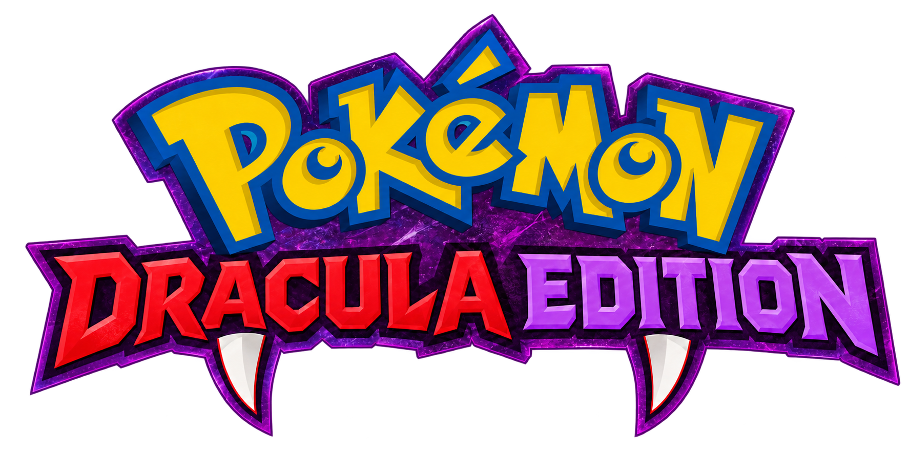

# Poke Dracula Edition




## Credits

The Pokemon sprites and portraits in `assets/` come from the **[PMD Sprite Collab](https://sprites.pmdcollab.org)**,
a community project. Each sprite and portrait is the work of individual contributors, who are
credited per-Pokemon on the project's
**[Contributors page](https://sprites.pmdcollab.org/#/Contributors)**. Thank you to all of them.

Pokemon is a trademark of Nintendo, Game Freak and Creatures Inc. This is a non-commercial fan
project and is not affiliated with them.

Code, music, sound, UI and the fallback pixel art were made for this project.

A Pokemon-flavoured Vampire Survivors clone that runs in the browser. Vanilla JavaScript ES
modules, Canvas 2D and Web Audio -- no framework, no dependencies, no build step.

Every piece of supplied art and audio is optional. The PMD sprite sheets, the ripped tilesets and
the soundtrack all have a drawn or synthesised fallback in `src/data/art.js` and `src/audio.js`,
so the game runs from a bare checkout and gets better as assets are added. See
[`assets/README.md`](assets/README.md).

## Running it

ES modules will not load over `file://`, so the folder has to be served over HTTP. Run **one** of these
from this directory, then open the address it prints:

```
python tools/serve.py       # -> http://localhost:8000   (recommended while developing)
npx serve .                 # -> http://localhost:3000
python -m http.server 8000  # -> http://localhost:8000
```

`tools/serve.py` is the plain Python server with caching turned off. With the other two, a browser
can keep running an old copy of a script after it has been edited -- even across a server restart
-- so a change that is plainly in the code does not show up. If that happens, reload with
`Ctrl+Shift+R`, or tick *Disable cache* in the DevTools Network tab.

### Testing the secret floors

Portals are rare (15% per floor), so there are shortcuts. Add these to the address:

| Option | Effect |
|---|---|
| `?debug=1` then `O` in a run | Opens a portal right beside you, now |
| `?portal` | On floors 1-3, a portal opens beside you 3 seconds after arriving |
| `?boss=<name>` | Every portal leads to that legendary (`articuno`, `moltres`, `zapdos`, `regirock`, `regice`, `registeel`, `entei`, `raikou`, `suicune`) |

For example `?debug=1&char=eevee&stage=cave&boss=registeel` skips the menus; press `O`, step
onto the portal and press `Enter`.

## Controls

| Key | Action |
|---|---|
| `WASD` / arrow keys | Move; navigate every menu |
| `Q` / `E` | First / second ability |
| `Backspace` / `P` | Pause; back out of any menu (`Esc` also works, but in fullscreen the browser uses it to leave fullscreen) |
| `1`-`3` / arrows + `Enter` | Choose on any card screen |
| `Enter` | Take the stairs (standing on them); dismiss the evolution cutscene |
| `1` / `2` (after the boss) | Take the win / keep going into endless |
| `1`-`3` (`4` with the perk) during play | Use that slot of the Explorer's Bag; standing on an item with a full bag, swap it in |
| `Enter` (at an awake Fortune totem) | Make an offering |
| `R` | Reroll on level-up, restart otherwise |
| `B` / `S` | Banish / skip a level-up (press `B` twice to confirm) |
| `Q` (paused / after a run) | Back to partner select |
| `O` (paused) | Settings — volume, key bindings, back to menu, restart |
| `M` | Mute |
| `F` | Fullscreen -- 640x360 is an exact 3x fit for 1080p |

The game opens on a **main menu** — PLAY, SUCCESSES, KECLEON SHOP, OPTIONS, CREDITS — driven with
the arrows (or W/S) and Enter. PLAY goes to partner select, where you pick one of six
partners, and then to stage select.
`?char=wooper|eevee|rowlet|vulpix|delibird|gastly` skips straight into a run with that partner,
and `?stage=grass|cave|beach` picks where.

## Settings

`O` opens settings from the title screen or from the pause screen: separate music and sound
volume sliders, and a **controls page where every key can be rebound** — movement, both
abilities, pause, restart, mute, fullscreen, and the level-up reroll / banish / skip. Binding a
key another action already holds swaps the two rather than leaving anything unbound.

The arrow keys, `Enter` and `Escape` are fixed aliases and always work, so a binding you regret
can always be undone. Volumes and bindings are saved to `localStorage`, and a browser that blocks
storage simply starts from the defaults.

Two separate keys are written: `pokesurvivor.settings.v1` for preferences and
`pokesurvivor.save.v1` for the gold bank and shop ranks. They are kept apart deliberately --
losing your settings is an annoyance, losing your progress is not, and a corrupt blob in one must
not be able to take the other down with it.

## Debug tools

Append `?debug=1` to the URL for the developer overlay (frame timing, entity counts, hitboxes).
Other URL parameters: `?seed=`, `?t=` (start N seconds into a run), `?char=`, `?stage=`, `?level=`.
`?spriteedit=1` opens the in-page pixel editor used to author the sprites in `src/data/art.js`.

## Abilities

Each partner has two abilities, exclusive to it, drafted from the level-up screen. The first is
guaranteed to appear within three level-ups; the second unlocks when you evolve at level 10.

Evolving plays a cutscene that **holds on its last frame until you press Enter**, so you get to
read which form you landed on and what it changed before being dropped back into the crowd. The
new form lands with a shockwave that clears the area and a second and a half of invulnerability.

| Partner | `Q` | `E` (after evolving) |
|---|---|---|
| Wooper | **Protect Bubble** -- shield that blocks all contact damage, then bursts | **Earthquake** (Quagsire) -- shockwaves that stun; flying enemies are immune |
| Rowlet | **Homing Leaf** -- blades that seek separate targets and curve back | **Spectral Arrow** (Dartrix) -- pierces a line, executes the wounded, leaves a burning trail |
| Eevee | **Hyperbeam** -- massive damage, but you cannot move while firing | **Thunderbolt** (Jolteon) -- lightning falls from the sky into a marked circle and leaves it crackling |
| Eevee | | **Hydro Pump** (Vaporeon) -- a tsunami: a wall of water that rolls out along the aim, sweeping everything ahead of it and healing you |
| Eevee | | **Dark Pulse** (Umbreon) -- rings that leave a lasting pool of shadow |
| Gastly | **Shadow Ball** -- an orb thrown at a target that gnaws at everything it drifts past, then bursts | **Night Shade** (Haunter) -- opens a shadow that drains whatever stands in it |
| Vulpix | **Flamethrower** -- hurls a spinning fire star that bursts where it lands, leaving everything burning | **Fire Spin** (Ninetales) -- a vortex of flame that wraps around you and moves with you |
| Delibird | **Present** -- throws the gift on a short arc: four times in five it detonates, the fifth time it heals you | **Blizzard** (Hustle) -- hail falls across the whole screen; little damage, but nothing moves through it |

Every ability has its own sound, named on the ability itself rather than derived from what it
does -- Dark Pulse, Night Shade and Lick are all built from the same ring effect and have to sound
nothing like each other. Fire Spin and Thunderbolt each pick between two files on every cast.

Both abilities level 1-5 through further level-up draws. The HUD shows each slot's icon, its key,
and a cooldown that drains as it recharges. Below 20% health a `!` appears over your Pokémon's
head, the way it does in Mystery Dungeon, and stays until you heal.

### Burn

Fire is the only thing in the game that keeps hurting after it has hit you. A burning enemy takes
damage four times a second for as long as it lasts, carries an animated flame over its head, and
**ignores armour** -- charging the armour toll on every instalment is an artefact of the tick rate
rather than a decision, and it would leave fire doing almost nothing to exactly the rock-types it
ought to melt. Burns refresh rather than stack: the strongest and the longest win.

Casting plays your form's **Attack animation** once, from its own PMD sheet, in whatever
direction you are facing. Decidueye and Gengar do not grant a third ability --
they make the second one enormous instead.

## Weapons and types

Every weapon has a **Pokemon type**, shown on its level-up card as the same colour-coded badge
the partner select uses, and you are only ever offered weapons matching one of your
current form's types. Eleven types, six weapons each, **four weapon slots** -- so a run picks four
out of six and no two partners play out of the same toolbox. Evolving changes the pool for future
draws; it never takes away a weapon you already hold.

| Form | Pool |
|---|---|
| Wooper / Quagsire | Water + Ground |
| Eevee | Normal |
| Vaporeon / Jolteon / Umbreon | Water / Electric / Dark |
| Rowlet / Dartrix | Grass + Flying |
| Decidueye | Grass + Ghost |
| Gastly / Haunter / Gengar | Ghost + Poison |
| Vulpix / Ninetales | Fire |
| Delibird | Ice + Flying |

Weapons run to **level 10**, passives to five to seven picks, and once that pool finally thins
out **Mastery** cards appear — uncapped +6% power, +5% area and the like — so a very long run, or
an endless one, never runs out of things to take.

No two weapons share a delivery mechanism. There are twenty firing behaviours -- among them mines
you leave behind, turrets that fire on their own, shots that ricochet and gain damage, seeds that
detonate seconds later, beams that burn everything on the line to their target, vortices that drag
the crowd together, and an attack that charges while you stand still -- and `initWeaponDefs()`
warns at boot if two weapons ever end up with the same `behavior` + `motion` pair.

### Overloads

A weapon at **level 10** turns your next level-up into an **OVERLOAD** draft: its three overloads,
side by side, and you take **one, for the rest of the run**. Every weapon has its own three — 234
in all, the eleven evolutions and Substitute included:

- **AMPLIFY** — what the weapon already does, pushed further, with a twist (Mudslide Barrage: two
  more globs, and every splash leaves a deep bog).
- **TRANSFORM** — a new shape or function: a ring of shots, front-and-back, four ways, a turning
  spiral, three-shot volleys, a vortex that collapses for triple damage, a coil that becomes a
  railgun, a sweep that goes all the way round.
- **WILD** — an elemental or status twist: burns, freezes, paralysis, confusion, marks that make a
  target take more from everything, chains of lightning, explosions and homing spirits on a kill.

An overloaded weapon glows softly in its overload's colour, sheds particles, tints the ground it
lays, and marks what it does on the enemies — a reticle, stars, circling birds, Z's, frost, poison
bubbles. About twenty overloads (Tri Element, Sacred Fire, the Wish Stars, Galaxy Barrage, Aqua
Ring, Inferno, Absolute Zero and more) fade from colour to colour as they fire. Its
procs have their own line in the damage breakdown, under the overload's name. Reroll and banish do
not apply to an overload draft; skip puts it off to the next level-up. An overloaded weapon keeps
its overload when it evolves; one that evolves first offers its evolved form's own three.

The data is `src/data/overloads.js` — a closed vocabulary of stats, patterns and hit / kill /
expiry / every-Nth effects, documented at the top of the file. `src/overload.js` runs the effects.

### Type matchups

Every enemy is its real Pokémon type, and so is every weapon, ability and overload. The matchup is
the real chart, softened:

| | |
|---|---|
| Super effective | ×1.5 (both of a dual type: ×2.0) |
| Not very effective | ×0.6 (floored at ×0.5) |
| "No effect" | ×0.5 — never zero, so no partner's kit goes dead on a stage |

Super effective damage numbers are orange (with the odd **SUPER EFFECTIVE!**), resisted ones grey.
The stage select shows each stage's **STRONG HERE** types, weapon cards carry **STRONG HERE** /
**WEAK HERE** for the floor you are on (or the legendary you are fighting), and the pause screen
lists both. Grass Route is weak to Ice and Flying, Damp Cave to Water, Ground, Grass and Ice, Beach
Cave to Grass and Electric. The chart and every species' types are `src/data/types.js`.

## Stages

Every stage is a **bounded square**. Walls stop the player, the enemies and the camera, and the
spawn director keeps everything inside — the arena size is `arena` in `src/data/stages.js`.

You pick one on the **world map**: each stage is a dot on Mystery Dungeon's map, and the list
beside it shows its difficulty and what to expect. Arrows (or W/S) move through the list, `Enter`
or `1`-`3` sets off, and your partner walks across the map to whichever is selected.

| Stage | Arena | Ground |
|---|---|---|
| Grass Route | 3456² | Forest Path — mixed forest floor with ponds, walled by the canopy |
| Damp Cave | 2880² | Mt. Thunder — one open floor of rock, walled all the way round |
| Beach Cave | 3840×3456 | Beach Cave — sand floor with tide pools, inside the cave wall |

All three are drawn from ripped PMD art, 24px tiles at a time, and everything on them — where the
ponds lie, which ground tile goes where — is generated from the run seed per tile by
`src/terrain.js` and never stored, so walking back over ground finds it exactly as you left it.
Each stage keeps its procedural layers as a fallback if the image is missing.

**Water** stops anyone who walks. Water, Flying and Ghost-type partners cross it, and so do the
flying and water species among the enemies; the rest **path round it** (`src/paths.js`: one flow
field toward you, rebuilt as you move, that every walker reads), so a pond is cover from a crowd
but never a wall it gets stuck on. Swim out into one and the walkers wait on the nearest shore.

## Floors

At **5:00, 10:00 and 15:00** a staircase appears somewhere in the arena, always outside the
camera so you never see one arrive. Stand on it and press `Enter` to drop onto the next floor of
the same stage. Ignoring it is a perfectly good run; the stairs are the only decision the game
offers that is not a card.

A deeper floor is the *same* stage — same tiles, same music, same roster — with the whole
director curve multiplied:

| Floor | Enemy HP / damage | Spawn rate and cap | XP and gold | Bonus on a win |
|---|---|---|---|---|
| 1st | — | — | — | — |
| 2nd | ×1.35 | ×1.20 | ×1.50 | +200 |
| 3rd | ×1.70 | ×1.40 | ×2.00 | +500 |
| 4th | ×2.05 | ×1.60 | ×2.50 | +1000 |

Reward outruns risk on purpose: the bottom floor is 2.05× as dangerous and 2.5× as generous.

A cave counts **downward** — Damp Cave and Beach Cave run `1F, -1F, -2F, -3F` and draw the
descending flight — while Grass Route climbs a hillside and runs `1F, 2F, 3F, 4F`. The current
floor sits next to the timer from the first minute.

**What crosses with you:** the run clock, your level, XP, weapons, passives, abilities and the
gold already collected. Your **current HP comes too, unhealed** — descending wounded is the
gamble. **What does not:** every enemy, every uncollected orb and coin, and all the scenery. Sweep
the floor before you take the stairs, because whatever is lying on it is left behind.

The 20:00 boss and the mini-bosses run off the global clock, so a floor change never reschedules
them, and a staircase left standing is not replaced — dawdle past 10:00 and 15:00 with the first
one untaken and those marks are spent, so taking it at 16:00 gets you one floor, not three.

## Traps

Five Mystery Dungeon trap tiles lie in the floor: **spike** (damage), **explosion** (damage in a
radius), **slumber** (holds you still), **poison**, and **warp** (throws you somewhere else in
the arena). They are placed off-camera so you never see one arrive, and each cell is remembered —
a sprung trap never comes back.

They are **invisible until you get within about 80px**, fading in as you close, which is roughly
half a second of warning at walking pace. And **enemies set them off too**: a trap you have
spotted stops being a tax and becomes ground you can fight over. Deeper floors are visibly worse
ground — density rises 35% per floor.

Seven more tiles join them:

| Tile | On you | On an enemy |
|---|---|---|
| **Summon** | seven of the stage's Pokémon burst in around you | — |
| **Pitfall** | you fall straight to the next floor (spike damage on the last) | it falls: gone, no drop |
| **Gust** | everything nearby is blown away, and so are you | the same blast |
| **Seal** | one of your weapons is jammed for 8 seconds | — |
| **Slow** | a long chill | slowed by half |
| **"?"** | becomes some other tile when it goes off | the same |
| **Wonder Tile** | the good one: cleanses you, heals 15%, then 15s of +20% power and speed | — |

A Wonder Tile glints and shows from twice as far. Which tile turns up is weighted, and leans by
stage: more pitfalls in the cave, more gusts on the beach, more Wonder Tiles on Grass Route.

## Totems

Two **totems** stand somewhere on every floor (never on a secret floor), two different kinds of
three, and arrows at the edge of the screen point to them. **Stand in a totem's ring for four
seconds** to wake it — the ring drains if you step out, and the crowd comes in 60% harder while
you stand there.

- **Blessing totem** — a draft of three **blessings**: rare boons that last the run, each at most
  once (+1 projectile, +25% area, +20% damage, regeneration, +2 pierce and so on). It costs no
  level-up.
- **Trial totem** — 30 seconds: three elites and their escort appear around it. Defeat all three
  elites in time and a **treasure chest** drops: one, three or five levels on your weapons (luck
  favours the bigger hauls), and sometimes a bag item. Fail, and the totem crumbles.
- **Fortune totem** — press `Enter` in its ring to offer gold (a quarter of what you carry, at
  least 50, more each time, three times): a blessing, a bag item, double your gold back, or — less
  often the luckier you are — a minute-long **curse**.

Totems are `src/totems.js` and `src/data/totems.js`.

## The Explorer's Bag

Single-use items, kept in a bag of **three slots** (four with a perk), shown bottom left and used
with **1, 2, 3**. Elites usually leave one, bosses always do, scenery sometimes; chests and Fortune
totems give them too. Walk over one with a full bag and the game tells you how to swap.

| Item | Use |
|---|---|
| Oran Berry | Restores half your health |
| Sleep Seed | Everything within 240px falls asleep for 6s (a boss for 1.5s): it stays put, takes hits without waking, and cannot bite |
| Gravelerock | Sixteen rocks hurled out in every direction |
| Warp Seed | Warps you somewhere safe, well away |
| Totter Seed | Everything on screen is confused for 6s, staggering about at random instead of chasing you |
| Petrify Orb | Everything on screen turns to stone for 5s and takes 50% more damage |
| All-Power Orb | 20s of +40% power, +30% attack speed, +15% speed |
| Max Elixir | Both abilities ready at once, then 15s of -30% ability cooldown |
| Luminous Orb | Every trap on the floor shows, and arrows point to the stairs, portal and totems |
| Joy Seed | A level-up, on the spot |
| Escape Orb | Straight to the next floor, from anywhere |
| Reviver Seed | Works on its own: when you would faint, you are back at half health |

Timed effects — the orbs, the Wonder Tile, a Fortune curse — show above the bag with a bar that
runs down. The items are `src/data/bagitems.js`; `src/bag.js` uses them.

## Elites

Roughly once a minute from 2:30, one spawning enemy is promoted to an **elite**: six times the
health, a bigger hitbox, twelve times the XP, a guaranteed coin and an elixir when it dies. They
are drawn larger with a gold ring under them and a health bar above.

**Luck** shortens the gap between them — from one a minute at zero luck to one every 34 seconds
at the cap — and also raises drop rates, adds a chance for any kill to leave a pickup, and thins
the casino wheel's worst prize until, at 0.5 luck, it can never come up at all. Delibird reaches
exactly that by its second evolution, which is what its "the wheel never lands on its worst prize
again" has always been describing.

## Endless

Beating the 20:00 boss no longer ends the run on the spot: it opens a choice. **Take the win**
banks everything and rolls the credits. **Keep going** continues the run with a boss every two
minutes and **+300 gold for each one you fell**.

The win is locked in the moment the boss dies, and the floor bonus with it, so endless can only
ever add — dying in it still banks the victory, the floor bonus and every endless boss you took
down.

- **Bosses:** one every two minutes, and whenever none is alive a new one lands 1.5 seconds later.
- **They escalate:** each endless boss has +35% health, +15% damage and two more shots in every
  volley than the one before, and attacks a little faster (down to half its cooldown). From the
  third on, it calls in the stage's own Pokémon, more of them and more often each time.
- **Stairs and portals still work:** a staircase appears 20 seconds into endless and again three
  minutes after each one you take (down to the last floor), and the legendary portal can still
  open. No endless boss follows you onto a legendary's floor.

## Successes

Achievements, in their own window from the main menu. A locked card shows `???` as its title and
the requirement as its description; once unlocked it shows its real name. Unlocking happens the
moment you do it — a toast slides in mid-run and it is saved at once — but the reward is **claimed
from the window**: an unclaimed card has a golden outline, the menu shows a `!` with the count, and
Enter on the card banks the prize.

| Success | Requirement | Reward |
|---|---|---|
| Close Call | Get down to exactly 1 HP | 500 G |
| Maxed Out | Reach level 100 | 900 G |
| Kaboom | Kill 30+ enemies with a single ability use | 600 G |
| Punching the Screen | Die between 19:30 and 20:00 | 10 G |
| 1 in 512 | Start a run with a shiny Pokémon | 512 G |
| Legendary | Defeat all nine legendaries | 3000 G |

**Shiny Pokémon:** one run in 512 starts shiny, with a "A SHINY …!" banner, the form's shiny
sprites (its evolutions are shiny too) and a twinkle of stars every few seconds. A shiny run is a
lucky one: +20% luck (more drops, elites sooner, bigger chests, a kinder wheel and Fortune totems),
a legendary portal twice as often, one more reroll, and level-up cards that lean toward upgrading
what you already carry. `?shiny=1` forces one when testing.

The victory screen shows your partner's face, one of its three happy portraits at random; the
defeat screen one of its three sad ones.

**Expedition Records** add twenty-two harder ones — each a bronze, silver, gold or platinum tier:

| Success | Requirement | Reward |
|---|---|---|
| Lone Wolf | Win holding only one weapon | 1200 G |
| Untouchable | Take the stairs without being hit on that floor | 600 G |
| Deep Diver | Reach the fourth floor of every stage | 800 G + **Packed Lunch** |
| Prodigy | Defeat a legendary at level 30 or lower | 1000 G |
| It's Super Effective! | 2,000 super effective hits in a run | 400 G |
| Overcharged | Four overloaded weapons at once | 700 G |
| Pack Rat | Use 50 bag items | 500 G + **Bigger Bag** |
| Trap Dancer | Spring 15 traps yourself, and win | 600 G |
| Shrine Keeper | Wake all three kinds of totem in a run | 500 G + **Shrine Friend** |
| Trial Champion | Win ten totem trials | 900 G + **Treasure Sense** |
| High Roller | Three lucky offerings in a run, with no curse | 600 G |
| Speed Explorer | The fourth floor before 16:00 | 900 G |
| Relic Hunter | Carry three relics | 1000 G |
| Ribbon Collector | A ribbon with every partner | 1500 G + **Second Wind** |
| Grand Champion | All eighteen ribbons | 5000 G |
| Iron Stomach | Win without eating a berry | 1000 G |
| Endless Hero | Ten bosses in one endless run | 2000 G |
| Type Expert | 5,000 super effective knockouts | 800 G + **Second Look** |
| One Punch | An elite felled in a single hit | 400 G |
| Full House | Three bag items, four overloads and six held items at once | 1000 G |
| Conqueror | Win on every stage | 1500 G |
| Wonder Walker | Step on 20 Wonder Tiles | 400 G |

**Perks** are permanent from the next run on: *Packed Lunch* and *Second Wind* start every run
with an Oran Berry / Reviver Seed in the bag, *Bigger Bag* adds a fourth slot, *Shrine Friend*
wakes totems 30% faster, *Second Look* gives a reroll more, *Treasure Sense* makes every chest
hold at least three upgrades.

Claimed successes add up to your **Explorer Rank** — Normal, Bronze, Silver, Gold, Diamond, Super,
Ultra, Hyper, Master, with Mystery Dungeon's rank badges — shown top left of the title screen and
at the head of the Successes window. And every win earns a **ribbon** for that partner on that
stage: green for Grass Route, purple for Damp Cave, blue for Beach Cave, shown on the partner
cards.

"Exactly 1 HP" means what the HUD shows. Kaboom counts everything one cast is responsible for —
including the pools, rings and burns it leaves behind — and starts over each time the ability is
cast. Successes are kept in the save beside the gold bank, and **RESET PROGRESS leaves them
alone**. The list is `src/data/successes.js`; a reward is an object (`{ gold: 500 }`) so other
kinds of prize can be added there later.

## Winning, and the Kecleon Shop

Butterfree arrives at 20:00. Beating it **wins the run**: everything on the field dies with it,
all of it is pulled in so the payout is actually collected, and after a few seconds a victory
screen shows the time, the level, the kill count and the gold.

Gold banks from **every** run -- win, death or quit -- and is spent at the **Kecleon Shop** on the
title screen (`S`). Everything there is permanent and applies to every run afterwards:

| Group | What it sells |
|---|---|
| Offence | Might, Haste, Reach, Multishot, Focus, Attunement |
| Survival | Vitality, Hide, Swiftness, Revive (a second chance at half health) |
| Fortune | Scholar, Greed, Magnetism, Luck |
| Draft | Extra rerolls, banishes and skips on the level-up screen |

Ranks stack by repetition rather than by scaling, so five ranks of a +8% upgrade read as +40% and
not x1.47 -- the same way five Might cards do in a run. **Reset Progress** refunds every coin ever
spent and clears every rank. The bank lives in its own `localStorage` key, separate from settings,
so a corrupt preferences blob cannot take your progress with it.

## Delibird's presents

Delibird, and nobody else, finds **presents** on the map. Walking onto one freezes the run and
spins a wheel:

| Prize | Chance |
|---|---|
| A small stat bonus | 26% |
| +1 projectile | 20% |
| A level | 18% |
| Trade a move in for a new one | 18% |
| A large stat bonus | 12% |
| Three levels | 6% |

Collecting one also takes Present's own cooldown off, so coming out of a three-second wheel
unable to throw the next one is not a thing that happens.

The prize is decided from the run seed the moment the wheel starts -- the spin is an animation of
a result that already exists. Trading a move in opens a second page showing everything you own
plus **Keep Everything**, which is a real option and still pays out. The offered move always
respects your type gating, and if there is nothing legal left to offer the wheel pays in stats
instead of handing over an empty menu.

## Pickups and systems

Enemies, destructible scenery and mini-bosses drop items you walk over:

| Item | Effect |
|---|---|
| **Magnet** | Vacuums every XP orb and coin on the field |
| **Sitrus Berry** | Heals 30% of max HP |
| **Blast Seed** | Clears the screen |
| **Elixir** | Evolves a maxed weapon (if you hold its paired item), otherwise grants a level. Pays gold either way |
| **Present** | Delibird only -- freezes the run and spins the prize wheel |

XP orbs come in **ten tiers** by value, differing in size and colour on a rarity ladder: green,
lime, teal, blue, violet, rose, ember, gold, magenta, white. Seven of those fall inside the 1-9
range the roster actually drops, so a Gigalith visibly out-drops a Rattata rather than both
landing on the same green pip; the last three are for elites, boss payouts and the merged orbs
the entity cap produces. Mini-bosses arrive at 5:00, 10:00 and 15:00 (Raticate, Graveler, Pidgeot), with
Butterfree as the final boss at 20:00. A boss pays out like one: a spray of a dozen or more orbs
and coins you can see from across the screen, plus exactly one power-up.

**Destructible scenery** — bushes, rocks and crates — breaks once and stays broken. Breaking one
almost always drops a little XP and gold and sometimes a single power-up, a crate being the
jackpot. New scenery keeps appearing as you move, but only ever out of sight beyond the screen
edge, and never above a hard cap. Weapons and abilities never *target* scenery; you break it with
shots that pass through it and with area damage.

The roster is 38 species built as **evolution lines**, and the swarm visibly grows up over a run
rather than only gaining a health multiplier: the early form turns up in the first minutes and the
final form late, so what you are fighting at 18:00 is the grown version of what opened the run.

**Every species belongs to exactly one stage.** Nothing is shared, so the three stages look like
three different places rather than one roster reskinned:

| Stage | Lines |
|---|---|
| **Grass** (14) | Rattata→Raticate, Caterpie→Metapod→Butterfree, Spearow→Fearow, Pidgey→Pidgeotto→Pidgeot, Applin→Flapple *and* Appletun, Tauros |
| **Cave** (13) | Zubat→Crobat, Diglett→Dugtrio, Geodude→Graveler, Roggenrola→Boldore→Gigalith, Aron→Lairon→Aggron, Skarmory |
| **Beach** (11) | Marill→Azumarill, Poliwag→Poliwhirl→Poliwrath, Zigzagoon→Linoone, Poochyena→Mightyena, Sandygast→Palossand |

Skarmory and Tauros spawn only in the last few minutes, so you meet each as a mini-boss first and
as a regular enemy afterwards.

**Nine of the thirty-eight shoot back**, all of them late forms — Graveler, Gigalith, Aggron,
Skarmory, Fearow, Pidgeot, Butterfree, Poliwrath and Palossand — so nothing ranged turns up before
minute ten. Ordinary enemies fire a single shot or a narrow three-shot fan; only **bosses** fire
the full radial ring. Every attack **telegraphs** (the enemy stops dead and flashes first), and
nothing off the edge of the screen ever fires.

Volume is capped **field-wide**, not per enemy: ordinary shooters share one clock, and at most
one of them may start an attack every 1.1 seconds however many are alive (`VOLLEY_GAP` in
`src/enemies.js`). A shooter that finds the budget spent just keeps walking. Bosses are outside the
budget — their pattern is the fight.

**Mini-bosses are per stage**, drawn from that stage's own roster — a global list had the beach
fighting a Graveler that never otherwise sets foot there:

| | 5:00 | 10:00 | 15:00 | 20:00 |
|---|---|---|---|---|
| Grass | Raticate | Tauros | Pidgeot | Butterfree |
| Cave | Graveler | Skarmory | Aggron | Gigalith |
| Beach | Linoone | Azumarill | Palossand | Poliwrath |

**Revives** bought from the shop are spent automatically: at zero health you get back up at half
health with a two and a half second mercy window, and everything nearby dies. Only when you have
none left does the run end.

**Weapon evolution:** take a weapon to level 10, hold its paired item, then pick up an
**elixir** (elites always drop one). The item's card says which weapon it evolves, and the pause
screen flags a weapon that is ready. Every type has one:

| Weapon | + Item | Becomes |
|---|---|---|
| Mud Shot | Mystic Water | Quagmire |
| Swift Star | Silk Scarf | Star Barrage |
| Leaf Arrow | Sharp Beak | Spirit Shackle |
| Ember Spit | Charcoal | Fire Blast |
| Powder Snow | Never-Melt Ice | Sheer Cold |
| Sludge Bomb | Poison Barb | Gunk Shot |
| Bubble Beam | Sea Incense | Hydro Cannon |
| Spark Chain | Magnet | Thunder |
| Foul Play | Black Glasses | Night Slash |
| Aerial Ace | Pretty Wing | Sky Attack |
| Shadow Ball | Spell Tag | Shadow Storm |

The eight newer evolutions are generated from their base weapon **folded all the way to level
10**, with the evolution layered on top — an evolved weapon restarts at level 1 on its own numbers,
and building it this way means evolving can never be a downgrade. Each also changes what the weapon
*does* (more bounces, more jumps, more shards), not only how hard it hits. There are fourteen held
items and six slots, so which pairings you chase is a real decision.

**Damage breakdown:** every point of damage is credited to whatever dealt it — each weapon, each
ability, the pools and burns they leave behind, and traps. The victory and death screens show a
ranked list with bars coloured by weapon type, and the pause screen shows each weapon's total so far.

## Audio

Music tracks listed under `music` in `assets/manifest.json` are streamed per context -- one list
per key, picked at random each time:

| Key | When |
|---|---|
| `menu` | Title, partner select and credits |
| `grass` / `cave` / `beach` | Whichever stage the run is on |

Fifteen tracks are wired today: one for `menu`, four for `grass`, six for `cave` and four for
`beach`.

Tracks stream rather than decode, so the ~35MB set costs nothing at boot. **Tracks do not loop:**
when one finishes, a different track from the same list starts, so a twenty-minute run on a stage
with four songs cycles through them.

Sound effects are synthesised at runtime, and so is a **fallback chiptune**: if a key has no track
listed, or the file fails to load, the synthesised theme takes over so the game is never silent.
Individual sounds can be replaced with real samples by listing them under `sfx` in the manifest --
see `assets/README.md`.

Browsers require a real keypress before audio can start, so the first key you press unlocks it.
`M` mutes.

## Debug keys

Available with `?debug=1`:

| Key | Action |
|---|---|
| `K` | Spawn 100 enemies (stress test) |
| `L` | Force a level-up |
| `T` | Skip forward 60 seconds |
| `G` | Toggle god mode |
| `H` | Toggle hitboxes and magnet radius |
| `[` / `]` | Timescale down / up (0.25x - 8x) |
| `R` | Restart the run |

`?atlas=1` renders a contact sheet of every sprite and the pixel font.
`?dirs=1` shows every PMD-backed form in all eight facings, to verify direction mapping.

## Development tools

`tools/spritegen.mjs` is the sprite authoring bootstrap. Creatures are described with drawing
primitives (ellipse, triangle, outline, mirror) and it emits the literal character grids in
`src/data/shapes.js`, which stay hand-editable afterwards.

```
node tools/spritegen.mjs                # ASCII preview of every shape
node tools/spritegen.mjs --only=eevee   # just one
node tools/spritegen.mjs --write        # regenerate src/data/shapes.js
```

`tools/shot.mjs` drives headless Chrome over the DevTools Protocol with no dependencies: it loads
the game, collects console output and uncaught exceptions, optionally holds keys or runs script,
and writes a PNG. It is how changes get verified without a human at the keyboard.

```
node tools/shot.mjs --url="http://127.0.0.1:8080/?debug=1" --out=shot.png --wait=3000 --gpu=1
node tools/shot.mjs --url="..." --hold=KeyD,KeyS --pre="window.__dbg.stress(600)" \
                    --eval="JSON.stringify(window.__dbg.perf())"
```

`--dpr=1.25` simulates Windows display scaling, which is what the integer-scaling canvas exists
to handle.
